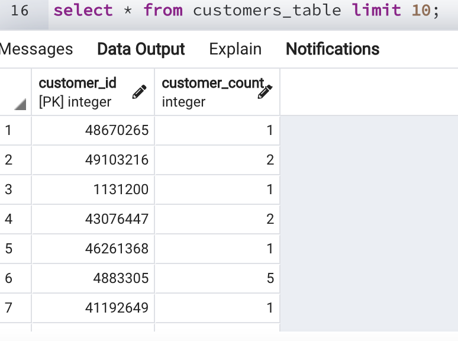
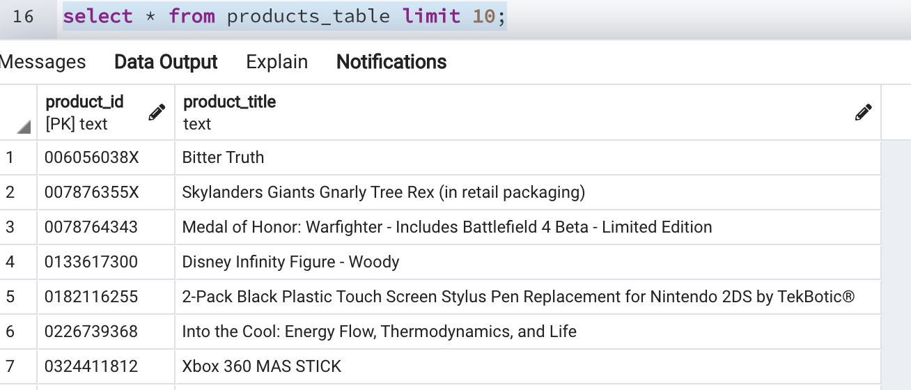
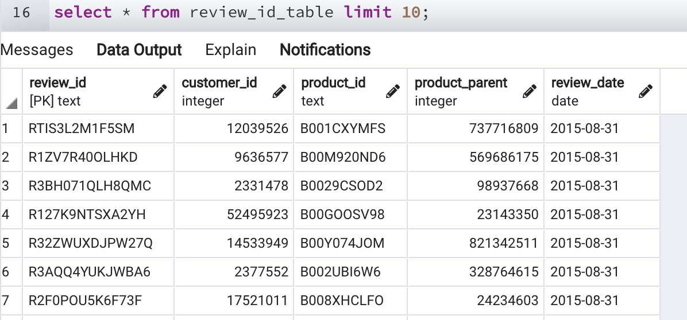
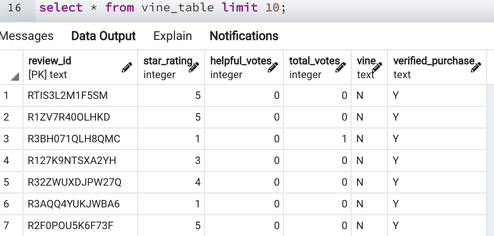
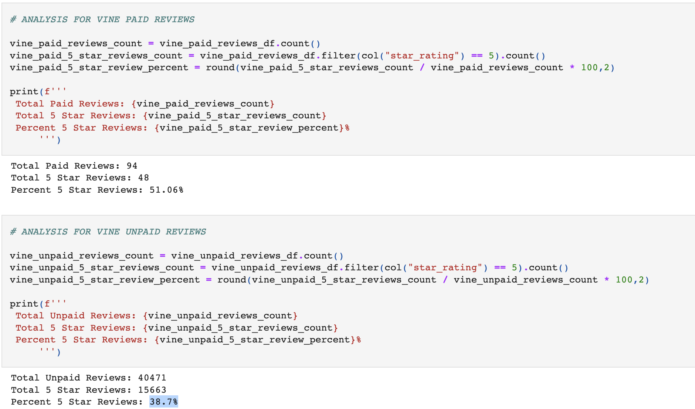
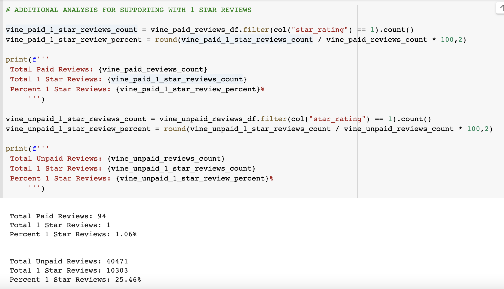

# Amazon Vine Analysis

## Overview of the Project

This project is to analyze amazon video game reviews. As part of this analysis all the data collected will be uploaded to a s3 bucket. This data will also be uploaded to amazon RDS to store in a postgres table.

Using the collected data an analysis will be performed on vine paid and unpaid users to see their bias.

## Resources
- Data Source: https://s3.amazonaws.com/amazon-reviews-pds/tsv/amazon_reviews_us_Video_Games_v1_00.tsv.gz or https://challenge-reviewdb-sanil.s3.amazonaws.com/amazon_reviews_us_Video_Games_v1_00.tsv
- Software: PySpark, Google Colab, AWS
---

## Results

All the tables were created and uploaded to AWS RDS. Below were the tables created.

Analysis Details:

1. Review Counts
 - Vine Paid Users: 94
 - Vine Unpaid Users: 40471

2. 5 Star Review Counts
 - Vine Paid Users: 48
 - Vine Unpaid Users: 15663

3. 5 Star Review Percent  
 - Vine Paid Users: 51.06%
 - Vine Unpaid Users: 38.70%

Dataframes used shown below:

---

## Summary

We can see that for Vine paid users there is a positivity bias with 51.06% giving 5 star rating vs 38.70% for unpaid users. 

This shows that paid users like to review on any occasion but unpaid users normally tend to put review on negative occasions.

Looking further we can see that for paid users only 1.06% has given 1 star rating but in unpaid users around 25.46% have given 1 star rating further supporting this statement.

1starReviewsImage

One key point need for further analysis is that the data set of paid users are small and hence collection of further data can help in confirming for future analysis.

